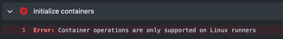

# Github Runner Bash
Because the [Docker solution](https://github.com/data-derp/github-runner-docker) is awaiting attention from the Github Actions team, this repository demonstrates a Github Runner via bash script on a Mac.

**UPDATE:** This does not work for containerised runs because Github Actions only supports container runs on Linux.



## Quickstart
1. [Create a Github Personal Access Token](https://docs.github.com/en/github/authenticating-to-github/creating-a-personal-access-token) with the Repo Scope. This will be used to generate a token to register a GithubRunner.
   
2. If your Github Runner will talk to AWS, set up your AWS CLI and authenticate to your AWS account and store those credentials in the `default` profile.
3. Start the runner
    ```bash
    ./go run <github-repo-url> <github username>
    ```
   You will be prompted for your `'host'` password. This is the Github Personal Access Token that you created in (1).
4. Trigger a pipeline in the `<github-repo-url>` and see it connect.